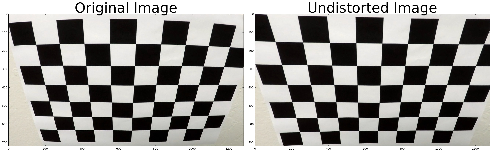
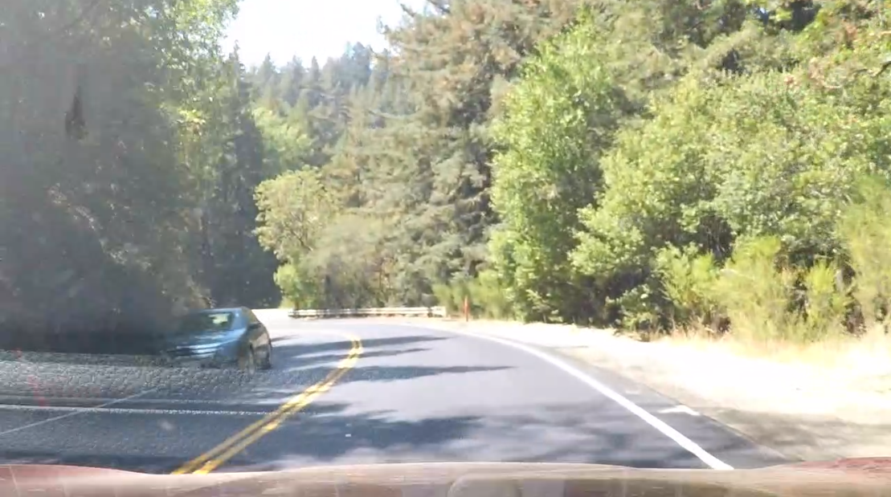
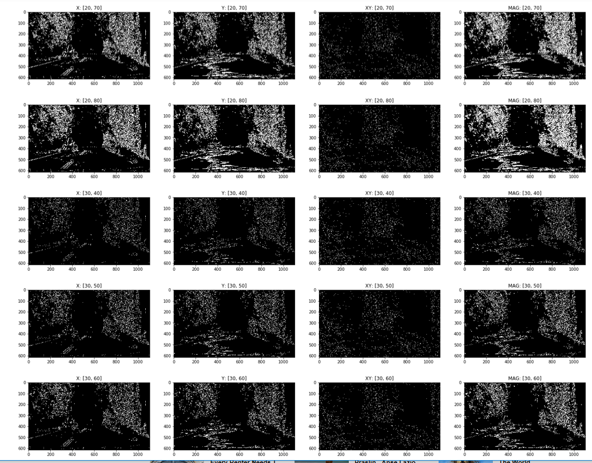
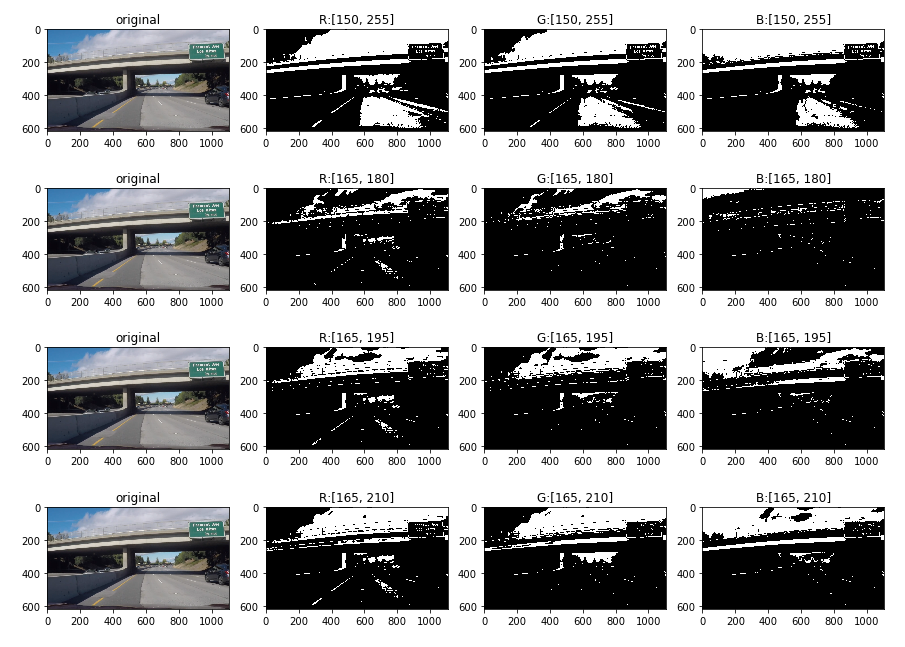
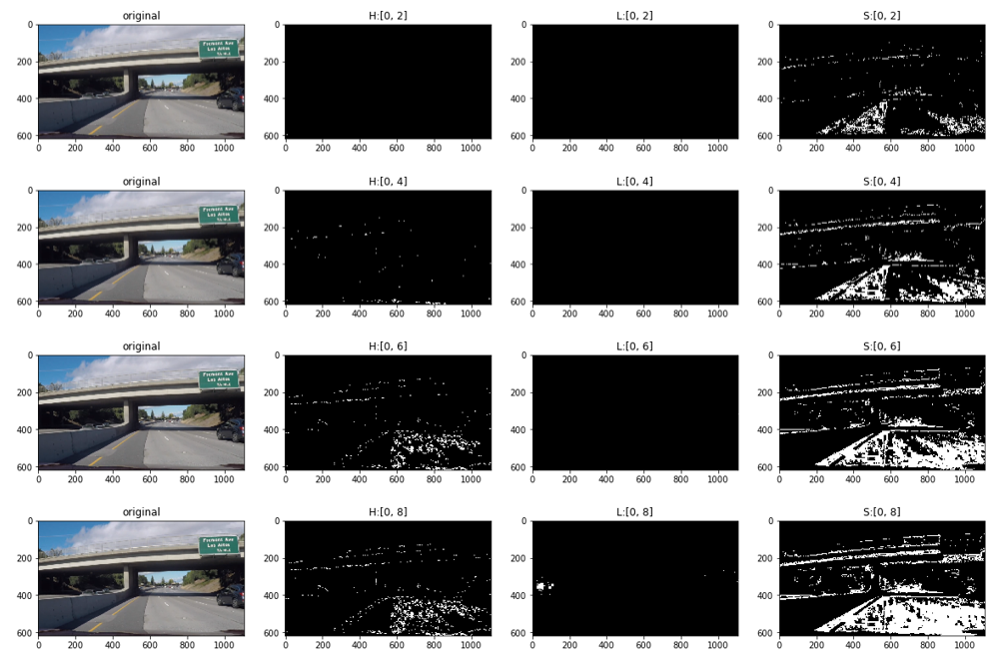
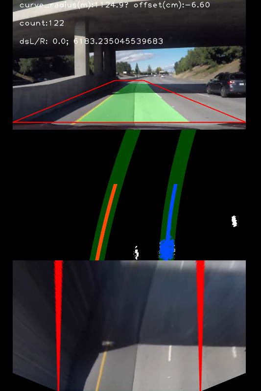
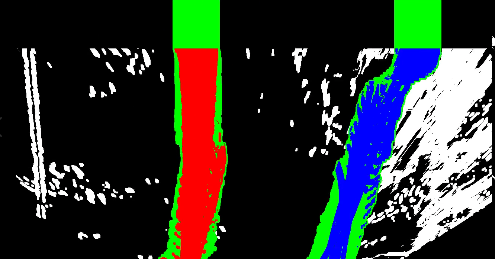
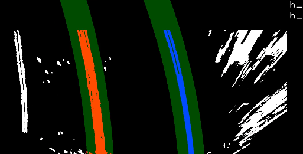
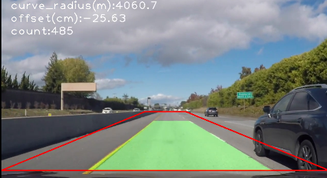

**Advanced Lane Finding Project**

The goals / steps of this project are the following:

* Compute the camera calibration matrix and distortion coefficients given a set of chessboard images.
* Apply a distortion correction to raw images.
* Use color transforms, gradients, etc., to create a thresholded binary image.
* Apply a perspective transform to rectify binary image ("birds-eye view").
* Detect lane pixels and fit to find the lane boundary.
* Determine the curvature of the lane and vehicle position with respect to center.
* Warp the detected lane boundaries back onto the original image.
* Output visual display of the lane boundaries and numerical estimation of lane curvature and vehicle position.

### Here I will consider the rubric points individually and describe how I addressed each point in my implementation.  

---

### Camera Calibration

#### 1. Briefly state how you computed the camera matrix and distortion coefficients. Provide an example of a distortion corrected calibration image.

The code for this step is contained in the first code cell of the IPython notebook located in "./Camera_Calibration.ipynb".  

I start by preparing "object points", which will be the (x, y, z) coordinates of the chessboard corners in the world. Here I am assuming the chessboard is fixed on the (x, y) plane at z=0, such that the object points are the same for each calibration image.  Thus, `objp` is just a replicated array of coordinates, and `objpoints` will be appended with a copy of it every time I successfully detect all chessboard corners in a test image.  `imgpoints` will be appended with the (x, y) pixel position of each of the corners in the image plane with each successful chessboard detection.  

I then used the output `objpoints` and `imgpoints` to compute the camera calibration and distortion coefficients using the `cv2.calibrateCamera()` function.  I applied this distortion correction to the test image using the `cv2.undistort()` function and obtained this result: 

### Pipeline (single images)

#### 1. Provide an example of a distortion-corrected image.

To demonstrate this step, I will describe how I apply the distortion correction to one of the test images like this one:

#### 2. Describe how (and identify where in your code) you used color transforms, gradients or other methods to create a thresholded binary image.  Provide an example of a binary image result.

To find better threshold, I tried some methods to see which methods are workable.  then, I found Sobel x, HLS(H), and RGB(R) methods works well. 

- Sobel  
- Orientaion  
- RGB  
- LUT  
- HLS  
- Gray equlization & CLAHE  

example:    
  
  
  

I used a combination of color and gradient thresholds to generate a binary image:  
- Sobel x  ( kernel 9, threshold (20,255)  
- HLS(Hue)  (threshold (16,28)  
- RGB(R)  (threshold1 (170,255), threshold2 (240, 255)  

Also, I set condition on which binary images should be applied on each image processing in order to detect line effectively (avoid to detect pallarel lines adjacent to lanes or binary 1 area caused by bright contrast on the image).

#### 3. Describe how (and identify where in your code) you performed a perspective transform and provide an example of a transformed image.

The code for my perspective transform includes a function called `warped_image()`, which appears in lines 175 through 200 in the file `image_processing.py.`  The `warped_image()` function takes as inputs an image (`img`), as well as source (`src`) and destination (`dst`) points.  I chose the following source and destination points:

| Source        | Destination  |
|:-------------:|:-------------:|
| 0, 680         |  250, 720      |
| 560, 450      | 250, -1000(*) |
| 720, 450     |  1030, -1000(*) |
| 1280, 680   | 1030, 720     |

(*) Destination upper y position is adjusted in accord with curve radius.  

I verified that my perspective transform was working as expected by drawing the `src` and `dst` points onto a test image and its warped counterpart to verify that the lines appear parallel in the warped image.

#### 4. Describe how (and identify where in your code) you identified lane-line pixels and fit their positions with a polynomial?  

Mainly, 2 process:  
- Lane Detecting   
- Following Detected Lane  

Firstly, as Lane Detecting process,   
- In 10% bottom area, find x positions of left lane and right lane by binary histogram  
- Cut image vertically to 100 area    
- Finding pixels by rectangle search (x position + & - margin  x  100 devided height area) starting with bottom x positions  
- Middle x position of Next rectangle is mean x position of current rectangle   
- Roop this algorithm until last area of 100 area    

Secondly, as Following Detected Lane process:   
- Refer to the lane x positions which detected in previous frame(s)   
- Plot previous line pixels    
- Refer to the fit coefficient and set line with margin to select candidate pixels     

In each process, check validity of detected lanes with width of left and right lanes ("check()" in In Lane.py).  

   
   

#### 5. Describe how (and identify where in your code) you calculated the radius of curvature of the lane and the position of the vehicle with respect to center.

I did this in lines 450 to 491 in my code in `image_processing.py.`  

    ym_per_pix = 30/720 # meters per pixel in y dimension  
    xm_per_pix = 3.7/500 # meters per pixel in x dimension  

#### 6. Provide an example image of your result plotted back down onto the road such that the lane area is identified clearly.

I implemented this step in lines 304 through 333 and 382 through 446 in my code in `image_processing.py` in the function `depict_area()` and `detect_pixels_cont()`.  Here is an example of my result on a test image:

# Working
 

---

### Pipeline (video)

#### 1. Provide a link to your final video output.  Your pipeline should perform reasonably well on the entire project video (wobbly lines are ok but no catastrophic failures that would cause the car to drive off the road!).

Here's a [link to project video result](./project_video.mp4)  
Here's a [link to challenge video result](./challenge_video.mp4)   
Here's a [link to harder_challenge video result](./harder_video.mp4)  

---

### Discussion

#### 1. Briefly discuss any problems / issues you faced in your implementation of this project.  Where will your pipeline likely fail?  What could you do to make it more robust?

In harder challenge video, I found that predicting lane shape is almost impossible by using historical coefficient information with a method of RANSAC.   By that method, range might be predictable, but to predict 'one specific' coming lane shape (coefficient) is not available from probablistic approach.  Detected lanes will soon deviate from real lanes.

I wanted to erase noise pixels adjacent to lanes.  But like above, shape is not predictable, so it is not be able to detect which pixels should be  inrelevant...

 
